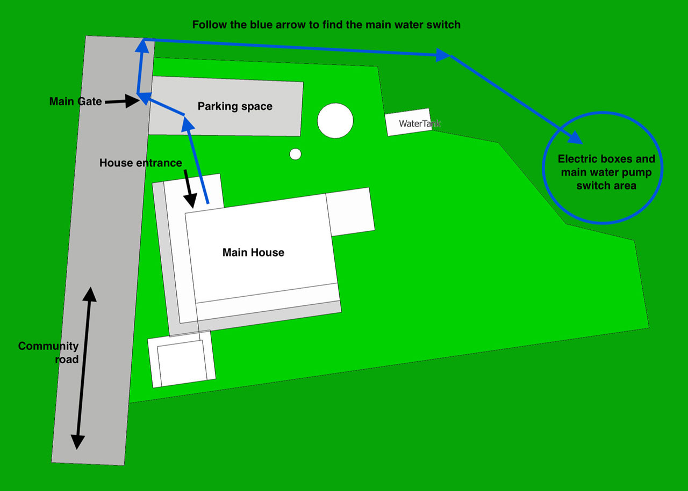
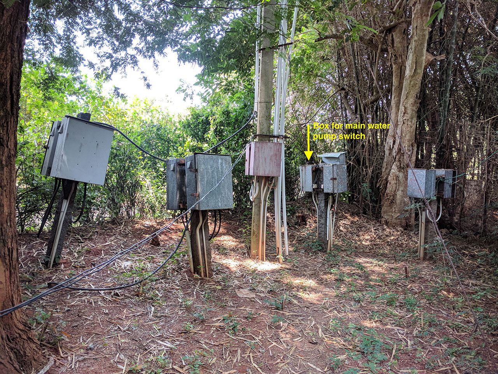
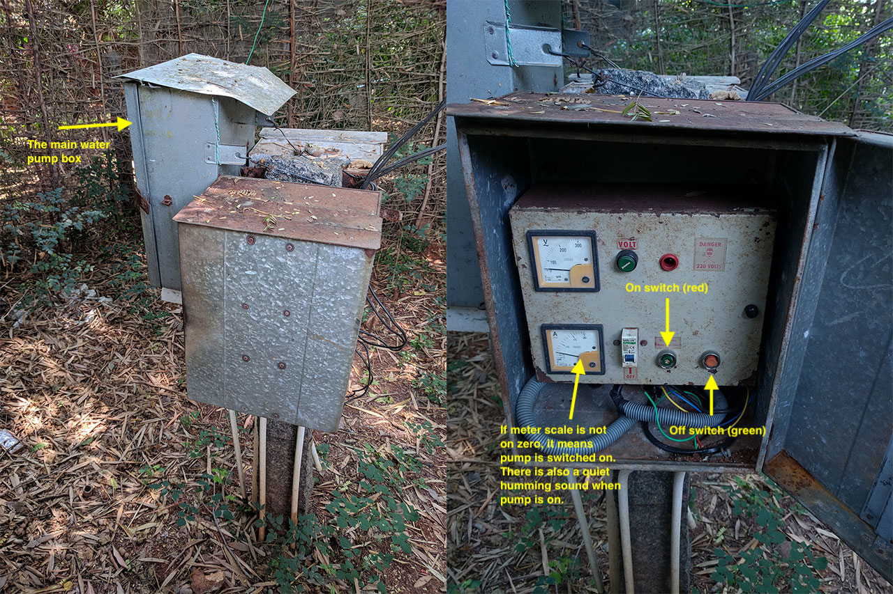

# ZEN+ India, House Instructions

## Water

### Main (Community) water pump

To switch water pump **on**, when there is no water, or to switch pump **off**, when there is overflow, please find the electrical switch of the pump as shown below:

