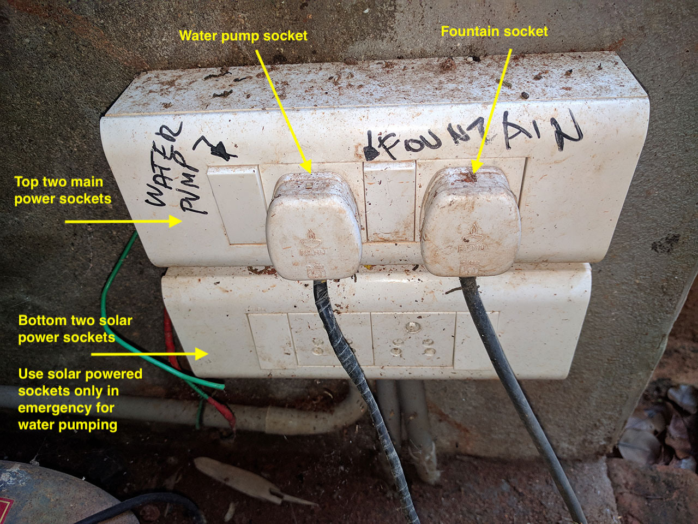

# ZEN+ India, House Instructions

## Water

### Main (Community) Water Pump

To switch water pump **on**, when there is no water, or to switch pump **off**, when there is overflow, please find the electrical switch of the pump as shown below:

### Local (House) Water Pump

Local water pump pumps the water from main community tank to the house's tank on the roof. It is automatic, but sometimes needs to be operated manually:
- in case of main community tank is empty
- if for any other reason pump does not start or stop

#### Pump and switch are located under main community tank

### Water Air Pressure Block

Sometimes, when roof water tank is completely emptied, air gets trapped in the pipes when pumping and water will not flow from any pipe in the house (even though roof tank is full). In this case small pipe on the roof needs to be opened to release air pressure from the pipes.   

